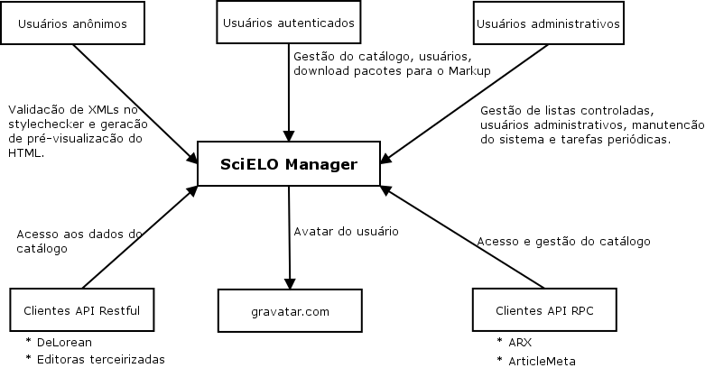
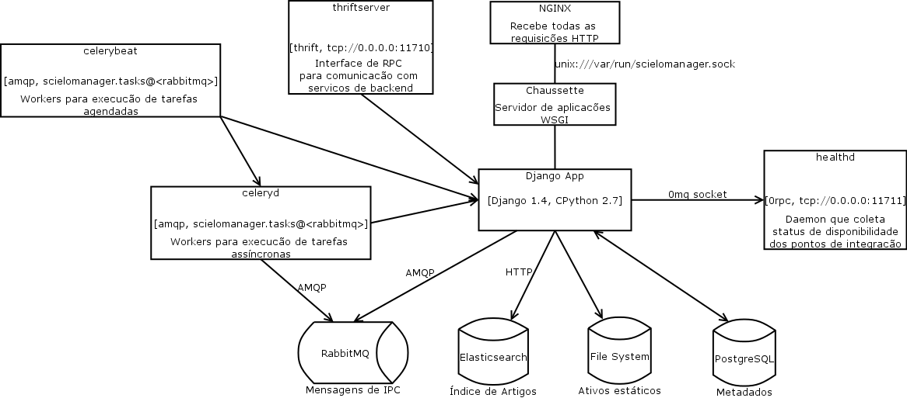

Visão geral da arquitetura
==========================

Contexto do sistema
-------------------

Componentes
-----------

Nginx
    Servidor web que recebe as requisições dos usuários, via HTTP, e as repassa 
    para a aplicação;

Chaussette
    Servidor de aplicação;

SciELO Manager - Django App (a aplicação)
    Coleção de componentes e implementações de regras de domínio de negócios e 
    fluxo de trabalho que dão suporte à gestão dos catálogos de periódicos;

RabbitMQ
    Contém tarefas para os processos "trabalhadores" - *Workers*;

Elasticsearch
    Contém o índice de busca para os registros de artigos;

Ativos digitais
    Os ativos digitais relacionados aos artigos são armazenados no sistema de 
    arquivos, e seus metadados no banco de dados relacional;

Banco de dados
    É onde todos as entidades relevantes ao domínio da aplicação estão 
    armazenadas de maneira persistente;

Thriftserver
    Mecanismo de comunicação inter-processos entre sistemas do backend, baseado 
    em Apache Thrift;

Celeryd
    Workers para a execução de tarefas assíncronas;

Celerybeat
    Workers para a execução de tarefas agendadas;

Healthd
    Daemon que coleta os status de disponibilidade dos pontos de integração 
    da aplicação, como serviços de backend, bancos de dados etc. É a primeira 
    parte de um componente que funciona como um "disjuntor".

