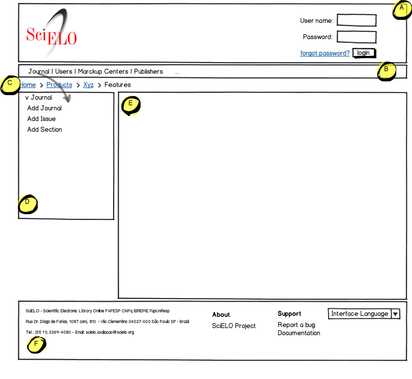

=================================
Mockups and Information Structure
=================================

-----------
Base Mockup
-----------

**A. Top Header**

1. Website Logotipo at the left 
2. User authentication and identification at the right

**B. Top Menu**

1. Catalogs horizontal list (Journal, Publisher, User, Marckup Center and other Catalogs)

**C. Breadcrumb**

1. Just a breadcrumb

**D. Left Menu Actions**

1. Change according to the selected catalog at the **Top Menu**
2. Give a list of available services for an specific catalog, and according to the user permissions  

**E. Central Area**

**F. Footer**

1. Institutional information
2. Generic Links
3. Support Links
4. List box to change the Interface Language

